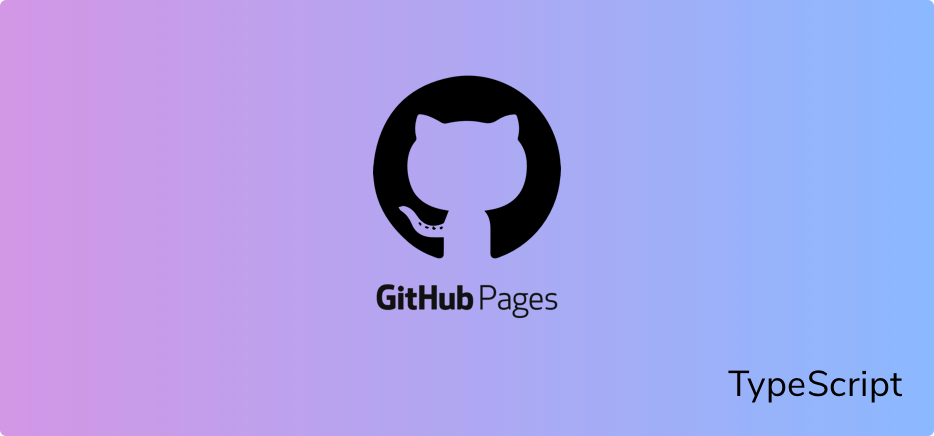

Hello welcome to my blog, in this oportunity i'm going to talk you about Continuous integration and continuos deployment. First of all we need to know, what is CI/CD? 

Continuous integration (CI) and continuous deployment (CD), also known as CI/CD, embodies a culture, operating principles, and a set of practices that application development teams use to deliver code changes more frequently and reliably.

CI/CD is one of the bestest practice for devops teams. It is also a best practice in agile methodology. By automating integration and delivery, CI/CD lets software development teams focus on meeting business requirements while ensuring code quality and software security.


## GitHub Pages

GitHub Pages are public webpages hosted and published through GitHub. The quickest way to get up and running is by using the Jekyll Theme Chooser to load a pre-made theme. You can then modify your GitHub Pages' content and style.

This guide will lead you through creating a user site at username.github.io.



## GitHub Actions

Automate your workflow from idea to production

GitHub Actions makes it easy to automate all your software workflows, now with world-class CI/CD. Build, test, and deploy your code right from GitHub. Make code reviews, branch management, and issue triaging work the way you want.


## The process

In this challenge i need to make a GitHub Pages using CI/CD. Applying automatization from the pull request to the deploy all runing the gitflow.

>1st step
Make a GitHub Pages with your free github account using the guide posted on [GitHub Pages](https://pages.github.com/).

>2nd step
Push your code to the repository that host the GitHub Pages

>3rd step
Create your branches. In my case i make 3 branches (Main, Develop and gh-pages) all the branches have a purpose that i will explain now. 

The 1st branch is Develop: In develop all the changes and feature develop is made here. 

This branch is the more unestable of the project, when the code is stable this code is pushed to main with a CI GitHub Action that is trigged when a pull request is made to merge the Develop and Main branch.

The 2nd branch is Main: In Main all the tested code is alocated is like the delivery version of the code ready for deploy. 

This branch is the more stable of all the project, here the code is ready for deploy this code is tested and review, when the pull request is acepted and the code is merge from develop to main this trigged another GitHub Action that deploy the code to the gh-pages branch that is published on the web. 

The 3rd branch is Gh-pages: This branch is the deployed version of the code running on the GitHub Pages.

>3rd step
Create your CI/CD pipeline with GitHub Actions, First i create the CI action.

```js
 This is a basic workflow to help you get started with Actions

name: CI

# Controls when the workflow will run
on:
  #push:
    #branches: [ main]
  # Triggers the workflow on push or pull request events but only for the main branch
  pull_request:
    branches: [ main ]

  # Allows you to run this workflow manually from the Actions tab
  workflow_dispatch:

# A workflow run is made up of one or more jobs that can run sequentially or in parallel
jobs:
  # This workflow contains a single job called "build"
  Test_CI:
    # The type of runner that the job will run on
    runs-on: ubuntu-latest
    
    # Steps represent a sequence of tasks that will be executed as part of the job
    steps:
      # Checks-out your repository under $GITHUB_WORKSPACE, so your job can access it
      - uses: actions/checkout@v3
      - name: Setup Node.js environment
        uses: actions/setup-node@v3.1.1
        with:
          # Version Spec of the version to use.  Examples: 12.x, 10.15.1, >=10.15.0
          node-version:  12.x
      - run: npm ci
      - run: npm test 
      - run: npm run build --if-present
```
Second i create the CD action.

```js
name: CD

on:
  push:
    branches:
      - main

jobs:
  build:
    runs-on: ubuntu-latest
    steps:
      - uses: actions/checkout@v2
      - uses: enriikke/gatsby-gh-pages-action@v2
        with:
          access-token: ${{ secrets.ACCESS_TOKEN }}
          deploy-branch: gh-pages

```

## My Opinion

This was a very tough challenge, i learn the magic behind CI/CD. GitHub Pages are public webpages hosted and publish through GitHub and the best of all are that this webpage is free easy to use very user friendly. GitHub Actions make easy to automate software workflows automating tests, integrations and deploys. 

In my project i use Gatsby blogs, this react-based framework for creating websites and apps in this project i make a mearly blog. Very easy to redact and keep updated, all the software workflow is automated from the push to the deploy with the GitHub Actions.
